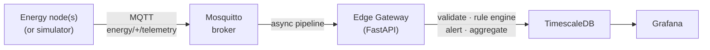

# Energy Edge Monitoring

Event-driven edge gateway for IoT-based smart energy monitoring. Built
directly from [`docs/architecture.md`](docs/architecture.md).



## Stack

- **Edge gateway** — FastAPI, SQLAlchemy 2 (async), `aiomqtt`, Pydantic v2,
  structlog. Subscribes to `energy/+/telemetry`, `energy/+/status`,
  `energy/+/events`, validates payloads, applies the rule engine, persists
  to TimescaleDB, and dispatches alerts.
- **MQTT broker** — Eclipse Mosquitto (`config/mosquitto/mosquitto.conf`).
- **Storage** — TimescaleDB hypertables for `energy_readings`, `events`,
  `system_metrics`, `device_status_history`; continuous aggregate
  `energy_readings_1min` is created from `database/init.sql`.
- **Dashboards** — Grafana with four provisioned dashboards
  (`config/grafana/dashboards/`).
- **Simulator** — `simulator/mqtt_publisher.py` with scenario YAML files
  (`simulator/scenarios/*.yaml`).

## Repository layout

```text
.
├── architecture.md          # authoritative spec (source of truth)
├── docker-compose.yml
├── .env.example
├── pyproject.toml           # workspace deps + tool config
├── gateway/                 # FastAPI edge gateway
│   ├── Dockerfile
│   ├── pyproject.toml
│   ├── app/
│   │   ├── main.py
│   │   ├── config.py
│   │   ├── logging_config.py
│   │   ├── api/             # health, devices, readings, events, metrics, rules
│   │   ├── db/              # models, session, repositories, timescale helpers
│   │   ├── mqtt/            # aiomqtt client + handlers + topic parser
│   │   ├── schemas/         # Pydantic v2 payload schemas
│   │   ├── services/        # validation, rule engine, ingestion, alert, metrics
│   │   └── workers/         # MQTT consumer, heartbeat, aggregation
│   ├── config/rules.yaml
│   └── tests/               # pytest unit tests
├── config/
│   ├── mosquitto/mosquitto.conf
│   └── grafana/             # provisioning + dashboards
├── database/init.sql        # TimescaleDB extension + continuous aggregate
├── simulator/
│   ├── mqtt_publisher.py
│   └── scenarios/*.yaml
├── scripts/                 # baseline/proposed test runners + report exporter
└── results/                 # output directory for run snapshots
```

## Quickstart

```bash
# 1. copy and adjust env
cp .env.example .env

# 2. start the stack (TimescaleDB + Mosquitto + edge gateway + Grafana)
docker compose up -d --build

# 3. wait for gateway readiness
curl -fsS http://localhost:8001/ready

# 4. build and run the MQTT simulator (one of the built-in scenarios)
docker compose build simulator
docker compose --profile loadtest run --rm simulator

# or run a specific scenario from the host
uv run python simulator/mqtt_publisher.py \
  --host localhost --port 1883 \
  --scenario-file simulator/scenarios/overload.yaml
```

Open:

- Gateway health: <http://localhost:8001/health>
- API docs (Swagger): <http://localhost:8001/docs>
- Grafana: <http://localhost:3001> (admin / admin)

## REST API summary

| Method | Path                                     | Description                       |
| ------ | ---------------------------------------- | --------------------------------- |
| GET    | `/health` / `/ready` / `/version`        | Liveness / readiness / build info |
| GET    | `/api/v1/devices`                        | List registered devices           |
| GET    | `/api/v1/devices/{device_id}`            | One device                        |
| GET    | `/api/v1/devices/{device_id}/status`     | Recent status history             |
| GET    | `/api/v1/readings?device_id=...`         | Recent readings                   |
| GET    | `/api/v1/readings/{device_id}/latest`    | Latest reading                    |
| GET    | `/api/v1/readings/{device_id}/aggregate` | Time-bucketed aggregates          |
| GET    | `/api/v1/events`                         | Filtered events                   |
| GET    | `/api/v1/events/{event_id}`              | One event                         |
| POST   | `/api/v1/events/{event_id}/acknowledge`  | Mark event acknowledged           |
| GET    | `/api/v1/rules`                          | List loaded rules                 |
| GET    | `/api/v1/rules/{rule_name}`              | One rule                          |
| PATCH  | `/api/v1/rules/{rule_name}`              | Toggle enabled flag               |
| POST   | `/api/v1/rules/reload`                   | Reload `rules.yaml`               |
| GET    | `/api/v1/metrics/summary`                | Counters + latencies              |
| GET    | `/api/v1/metrics/throughput`             | Throughput snapshot               |
| GET    | `/api/v1/metrics/data-reduction`         | Data reduction ratio              |
| GET    | `/api/v1/metrics/events-by-severity`     | Events grouped by severity        |
| GET    | `/api/v1/metrics/quality-by-type`        | Validation failures by type       |

## Rule engine

Rules live in `gateway/config/rules.yaml` and can be reloaded at runtime via
`POST /api/v1/rules/reload`. Each rule has a `type` of `threshold` or
`percentage_increase` (plus `heartbeat_timeout` which is handled by the
heartbeat worker). Examples:

```yaml
rules:
  undervoltage:
    enabled: true
    event_type: UNDER_VOLTAGE
    severity: WARNING
    condition:
      type: threshold
      field: voltage_v
      operator: lt
      value: 200
  power_spike:
    enabled: true
    event_type: POWER_SPIKE
    severity: WARNING
    condition:
      type: percentage_increase
      field: power_w
      percent: 30
      window_seconds: 60
```

Supported operators: `lt`, `le`, `gt`, `ge`, `eq`, `ne`.

## Processing modes

Set `PROCESSING_MODE=baseline` or `PROCESSING_MODE=proposed` in `.env`.

- **baseline** — every valid reading is stored; no rule engine runs (this
  matches `Section 14.1` of the architecture doc).
- **proposed** — validate, run the rule engine, store readings, store events,
  dispatch alerts (matches `Section 14.2`).

## Evaluation (baseline vs proposed)

```bash
# capture a baseline run
./scripts/run_baseline_test.sh
python scripts/export_results.py --output-dir results/baseline

# capture a proposed run
./scripts/run_proposed_test.sh
python scripts/export_results.py --output-dir results/proposed

# compare summary.md files in results/{baseline,proposed}/
```

## Tests

```bash
uv run pytest gateway/tests -v
```

24 unit tests cover the validator, rule engine, topic parser, and metrics
service.

## Extending the system

- Add new event types by appending a rule to `gateway/config/rules.yaml` and
  `POST /api/v1/rules/reload`.
- Drop an additional Grafana dashboard JSON into
  `config/grafana/dashboards/` — provisioning picks it up automatically.
- Plug a new alert channel into `gateway/app/services/alert_service.py`
  (the webhook and Slack clients are already there; add an email
  implementation alongside them by setting `ALERT_SLACK_WEBHOOK_URL`).
- Add ML predictions later by writing into the `model_predictions` table
  — the schema is already in place.
