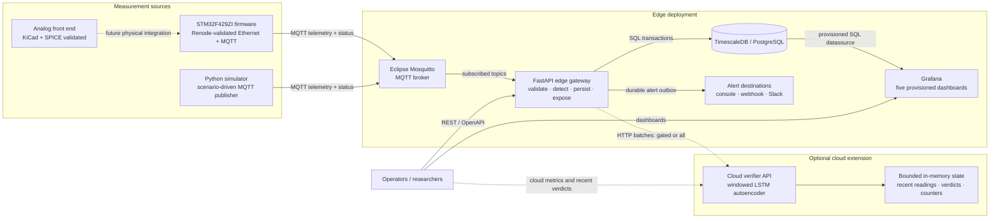
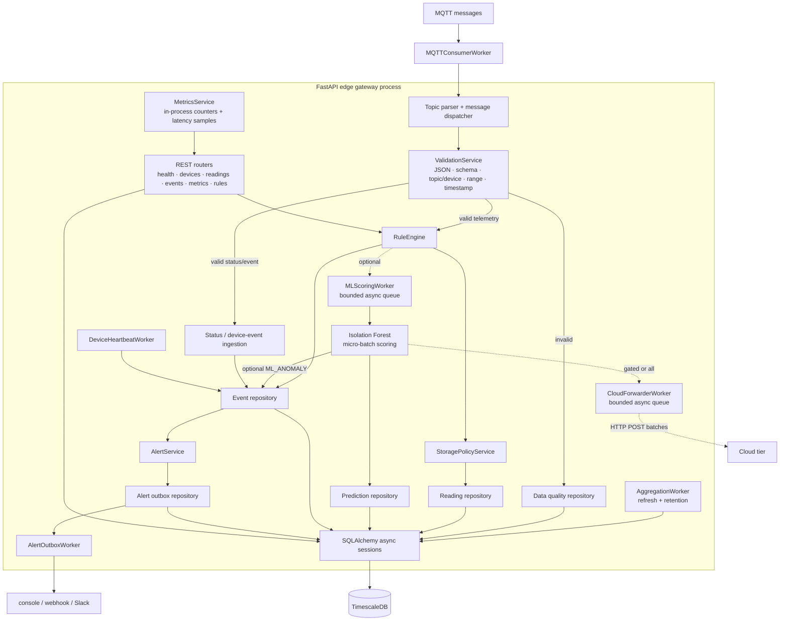
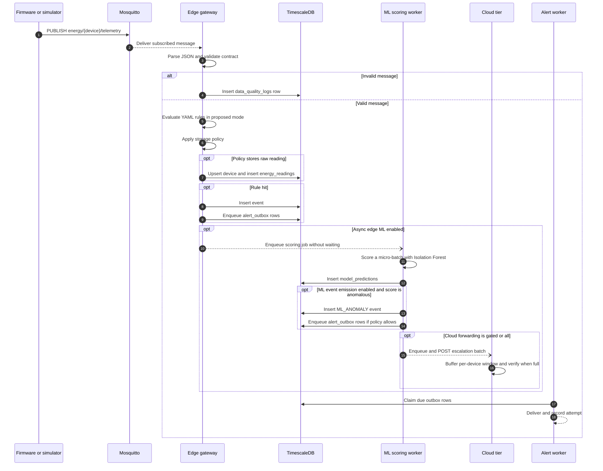
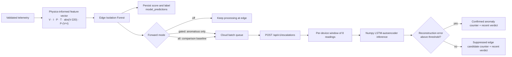
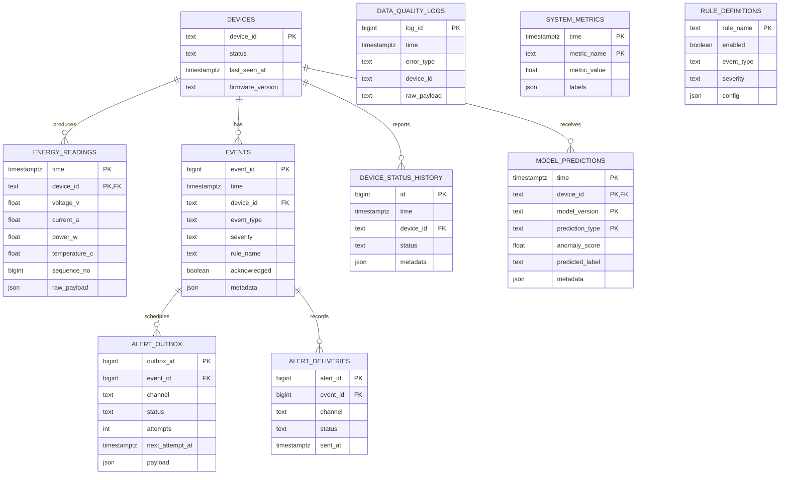
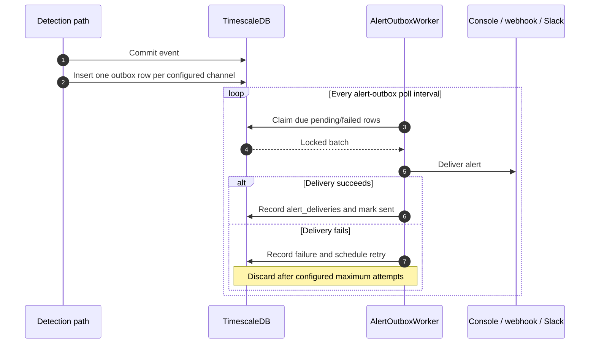
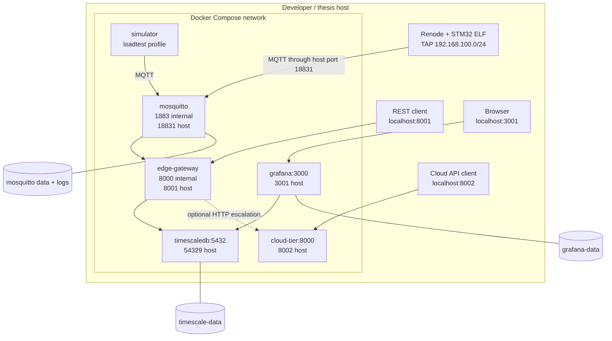
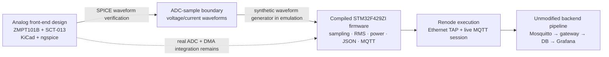

# WattFlow Architecture

> Edge-first, event-driven observability for smart energy monitoring
>
> Last reconciled with the repository: 2026-07-13 (`main` at `c58a1e6`)
>
> Contract reference: [HTTP API contract](api-contract.md)

This document describes the system that exists in this repository now. It is
an architecture reference, not an implementation wish list. Optional paths and
unfinished work are labeled explicitly.

## 1. Current architecture at a glance

WattFlow accepts energy telemetry from either the STM32 firmware or a Python
simulator, processes it at an edge gateway, stores operational evidence in
TimescaleDB, and exposes it through REST and Grafana. The proposed mode adds
rule-based detection, optional Isolation Forest scoring, durable alert
delivery, and optional score-gated forwarding to a cloud LSTM-autoencoder
verifier.

The defensible architecture claim is:

> WattFlow is an edge-first, event-driven observability architecture for smart
> energy monitoring. Detection remains available at the edge; optional cloud
> verification receives only selected, already-scored readings and is not on
> the critical ingestion path.

### 1.1 Implementation status

| Area | Status | Current evidence and boundary |
| --- | --- | --- |
| MQTT-to-database pipeline | Implemented | Mosquitto, async FastAPI gateway, validation, repositories, and TimescaleDB migrations |
| Deterministic detection | Implemented | Six YAML rules plus device-offline detection |
| Storage policy and retention | Implemented | `raw`, `hybrid`, `event_only`, and `aggregate_only` decisions; scheduled pruning |
| Alert delivery | Implemented | Durable outbox with console, generic webhook, and Slack channels |
| Edge ML, Phase 1 | Implemented and evaluated; off by default | Isolation Forest artifact, inline or asynchronous micro-batch scoring, persisted predictions |
| Edge-to-cloud gate, Phase 2 | Implemented and evaluated; off by default | `gated` and `all` forwarding modes with byte counters |
| Cloud verifier, Phase 3 | Implemented and evaluated; optional | Windowed LSTM-autoencoder verifier with in-memory recent readings, verdicts, and counters |
| STM32 firmware | Implemented and emulator-validated | Nucleo-F429ZI firmware publishes real MQTT through Renode and the live backend stack |
| Analog sensing front end | Designed and simulated | KiCad schematic and ngspice validation exist; no physically integrated/calibrated meter is claimed |
| Grafana | Implemented | Five provisioned dashboards |
| Kubernetes autoscaling, Phase 4 | Planned only | Design note exists; no manifests or scaling result are in the current system |
| Email alerts | Not implemented | An email provider/channel still needs to be added |
| Production security and field deployment | Not implemented | No API auth, MQTT TLS, device certificates, or field metrology validation |

### 1.2 System context

The cloud verifier does **not** currently write verdicts back to TimescaleDB.
Its recent readings and verdicts are bounded process memory, so restarting the
cloud service clears them. Edge rules, edge ML events, persistence, and alerts
continue without the cloud tier.

## 2. Runtime components and ownership

| Component | Repository location | Owns |
| --- | --- | --- |
| STM32 application | `firmware/app/` and `firmware/node-f429zi/` | Sampling, RMS/power calculation, JSON payloads, MQTT connection/LWT/reconnect |
| Python simulator | `simulator/` | Repeatable normal, anomaly, invalid-payload, and throughput scenarios |
| MQTT broker | `config/mosquitto/` | Topic routing and publisher/subscriber decoupling |
| Edge gateway | `gateway/app/` | Validation, detection, storage policy, persistence, workers, REST API, runtime metrics |
| Schema migrations | `database/migrations/` | Relational schema, TimescaleDB hypertables, and continuous aggregate |
| Rule configuration | `gateway/config/rules.yaml` | Thresholds, event types, severity, and enabled state loaded at runtime |
| Edge model | `models/anomaly_iforest.joblib` | Isolation Forest, scaler, feature metadata, and anomaly threshold |
| Cloud service | `cloud/app/` | Escalation receiver, per-device windows, LSTM-AE verification, cloud counters |
| Cloud model | `models/cloud_lstm_ae.npz` | Numpy-loadable LSTM-autoencoder weights and threshold |
| Dashboards | `config/grafana/` | Datasource provisioning and dashboard definitions |
| Experiments | `scripts/` and `results/` | Reproducible runners, pinned result artifacts, figures, and reports |

### 2.1 Edge gateway internals

The FastAPI lifespan builds one application container and starts all enabled
workers. Runtime schema creation is deliberately absent: Alembic owns the
database schema before the gateway starts.

### 2.2 Worker lifecycle

The gateway starts these workers when their configuration allows it:

1. metrics flushing;
2. alert HTTP client and alert-outbox polling;
3. cloud forwarding;
4. asynchronous ML scoring;
5. MQTT consumption;
6. heartbeat/offline detection; and
7. continuous-aggregate refresh and retention maintenance.

Shutdown reverses the dependency-sensitive portion of that order and disposes
the database engine. The ML and cloud workers attempt a best-effort queue drain
on shutdown; their queues are not durable.

## 3. Messaging and ingestion contracts

### 3.1 MQTT topics

| Topic | QoS default | Producer | Gateway behavior |
| --- | ---: | --- | --- |
| `energy/{device_id}/telemetry` | 0 | firmware or simulator | Validate, detect, apply storage policy, persist, optionally score |
| `energy/{device_id}/status` | 1 | firmware or simulator | Update device state and status history; an offline status can create a critical event |
| `energy/{device_id}/events` | 1 | External/future node publisher | Persist device-originated event; alert if critical |

The configured subscriptions are the three `energy/+/...` patterns above. The
current firmware and simulator publish telemetry and status, while the event
topic is an implemented gateway input without a current first-party producer.
The topic device ID must match the JSON `device_id`. Command and configuration
topics are not implemented in the gateway.

Every message carries `schema_version`, `device_id`, and `timestamp`.
Telemetry adds `voltage_v`, `current_a`, `power_w`, and optional
`temperature_c`, `sequence_no`, `firmware_version`, and `rssi_dbm`.

See [docs/api-contract.md](api-contract.md) for example payloads and the full
REST contract.

### 3.2 Telemetry sequence

Current ordering has one consequence worth preserving in reviews: with
asynchronous ML enabled, the raw-reading storage decision happens before the
ML result exists. Therefore `event_only` can skip a raw reading that is later
classified as `ML_ANOMALY`; the prediction and event still persist.

### 3.3 Validation and duplicate handling

Validation is fail-closed for ingestion:

- JSON must decode to an object;
- schema version must be supported (`1.0` by default);
- topic and payload device IDs must agree;
- Pydantic schemas enforce field types and non-negative electrical values;
- configurable physical ranges reject impossible readings; and
- telemetry/status timestamps must fit configured past/future skew limits.

Invalid payloads are recorded in `data_quality_logs` rather than readings.
Reading duplicates are constrained by the `(time, device_id)` primary key and
counted by gateway metrics when insertion is not performed.

## 4. Detection architecture

### 4.1 Deterministic rule engine

Rules are loaded from `gateway/config/rules.yaml` and can be listed, toggled,
or reloaded through REST. Toggling writes a `rule_definitions` audit/config
row, but reloading the YAML file restores the file's definition; the YAML file
remains the startup source of truth.

| Rule | Condition | Event | Severity |
| --- | --- | --- | --- |
| `undervoltage` | `voltage_v < 200` | `UNDER_VOLTAGE` | `WARNING` |
| `overvoltage` | `voltage_v > 250` | `OVER_VOLTAGE` | `WARNING` |
| `overload` | `current_a > 10` | `OVERLOAD` | `CRITICAL` |
| `power_spike` | power increases by at least 30% inside 60 seconds | `POWER_SPIKE` | `WARNING` |
| `voltage_anomaly_low` | `voltage_v < 210` | `VOLTAGE_ANOMALY` | `INFO` |
| `over_temperature` | `temperature_c > 60` | `OVER_TEMPERATURE` | `WARNING` |

The separate heartbeat worker emits `DEVICE_FAILURE` when a non-maintenance
device exceeds the configured silence timeout. Rule and alert cooldown state
is in process memory and resets when the gateway restarts.

### 4.2 Processing modes

| Capability | `baseline` | `proposed` default | `proposed` with ML/cloud flags |
| --- | --- | --- | --- |
| Contract validation and quality logging | Yes | Yes | Yes |
| Store every valid telemetry reading | Yes | Depends on storage policy | Depends on storage policy |
| YAML rule evaluation | No | Yes | Configurable |
| Derived rule events | No | Yes | Configurable |
| Isolation Forest scoring | No | No | Optional |
| `ML_ANOMALY` event emission | No | No | Optional and separately gated |
| Edge-to-cloud forwarding | No | No | `off`, `gated`, or `all` |

Device-originated messages still follow their own status/event handlers. The
mode switch primarily controls telemetry-derived processing and is intended
for controlled thesis comparisons rather than tenant-level runtime selection.

### 4.3 Edge ML and cloud verification

The edge artifact is trained offline by `scripts/train_anomaly_model.py`; the
cloud artifact is trained/exported by `scripts/train_cloud_lstm.py`. Both
runtime detectors disable themselves cleanly if their model is absent. The
cloud container performs numpy-only inference and does not include PyTorch.
Cloud forwarding currently hangs off the asynchronous ML scoring worker, so it
requires both `ENABLE_ML=true` and `ML_ASYNC_SCORING=true` in addition to a
non-`off` forwarding mode.

The cloud forwarder is intentionally loss-tolerant: queue overflow and failed
HTTP batches are counted and dropped, not retried. This preserves edge
availability but means the cloud stream is not an audit log.

## 5. Persistence architecture

Alembic migrations are the only schema authority. The initial migration owns
the core tables, TimescaleDB hypertables, and `energy_readings_1min` continuous
aggregate; the second migration owns the alert outbox.

### 5.1 Data model

`energy_readings`, `events`, `system_metrics`, and
`device_status_history` are configured as hypertables when TimescaleDB is
available. `energy_readings_1min` aggregates average voltage/current/power,
maximum power, minimum voltage, and sample count by device and minute.

### 5.2 Storage policies

Baseline mode always stores valid raw readings. Proposed mode delegates to
`STORAGE_POLICY`.

| Policy | Normal raw reading | Rule-triggering raw reading | Event and quality evidence |
| --- | --- | --- | --- |
| `raw` | Store | Store | Store |
| `hybrid` | Store only when `STORE_RAW_READINGS=true` | Store | Store |
| `event_only` | Skip | Store | Store |
| `aggregate_only` | Skip | Skip | Store |

`raw` is the safe default. The current `aggregate_only` implementation means
“do not persist raw readings”; it does not write a separate aggregate input.
Because the continuous aggregate reads `energy_readings`, a true
aggregate-only long-term path remains future work. Storage reduction must not
be claimed unless a selective policy is enabled and measured separately.

### 5.3 Retention

The maintenance worker runs once per minute and applies these defaults:

| Data | Default retention |
| --- | ---: |
| Raw readings | 30 days |
| Data-quality logs | 14 days |
| System metrics | 30 days |
| Device status history | 30 days |
| Alert delivery attempts | 30 days |
| Sent/discarded alert-outbox rows | 30 days |
| Events and model predictions | Indefinite; no pruning rule currently exists |

Retention is application-driven `DELETE`, not a TimescaleDB retention policy.
A value less than or equal to zero disables pruning for that table.

## 6. Alerting architecture

Alerts are derived from persisted events. By default only `CRITICAL` events
are eligible, and each `(device, event type, severity)` is suppressed during
the configured cooldown.

The unique `(event_id, channel)` index prevents duplicate outbox work. If the
outbox is disabled, the service delivers inline and records the attempt. Email
is not a configured channel in the current code.

## 7. REST and observability surfaces

### 7.1 Edge gateway API

| Group | Endpoints |
| --- | --- |
| Service state | `GET /health`, `/ready`, `/version` |
| Devices | list, detail, and status history under `/api/v1/devices` |
| Readings | list, latest, and aggregate under `/api/v1/readings` |
| Events | list, detail, and acknowledge under `/api/v1/events` |
| Rules | list, detail, toggle, and reload under `/api/v1/rules` |
| Metrics | summary, latency, throughput, data-reduction heuristic, event severity, and quality counts under `/api/v1/metrics` |

The edge metrics service is in process. Counters and latency samples reset on
gateway restart, although selected operational metrics are also flushed into
`system_metrics`. The current `data-reduction` endpoint is a runtime heuristic,
not sufficient evidence for a storage-reduction thesis claim.

### 7.2 Cloud API

| Method and path | Purpose |
| --- | --- |
| `GET /health` | Cloud service liveness |
| `POST /api/v1/escalations` | Accept a validated batch from the edge |
| `GET /api/v1/escalations/recent` | Return bounded recent escalated readings |
| `GET /api/v1/verdicts/recent` | Return bounded recent verifier verdicts |
| `GET /api/v1/metrics/summary` | Return bandwidth and verifier counters |

### 7.3 Grafana

Grafana reads TimescaleDB directly through a provisioned datasource. The five
dashboards are `Energy Overview`, `Device Detail`, `Event Timeline`, `System
Observability`, and `Thesis Evaluation`. Cloud verifier memory/counters are not
currently provisioned into Grafana.

## 8. Deployment topology

Docker Compose is the implemented deployment target. The firmware emulator and
hardware-design tools run outside Compose.

`just up` starts Mosquitto, TimescaleDB, Grafana, applies Alembic migrations,
and then starts the edge gateway. It does not start the optional cloud tier.
The cloud experiments start that service explicitly. The simulator is behind
the `loadtest` Compose profile.

Model and configuration mounts are read-only inside their containers. Database,
broker, and Grafana data use named volumes; cloud recent state and both async
worker queues are process memory.

## 9. Firmware and physical-system boundary

The current device story has three separately validated layers. They must not
be collapsed into a claim of field-hardware validation.

- The compiled firmware and network behavior are validated in Renode.
- Renode stubs the ADC, so firmware measurement input is synthetic 50 Hz
  waveform data passed through the real RMS/power calculation.
- The isolated voltage/current front end is independently designed in KiCad
  and simulated in ngspice, then checked through equivalent measurement math.
- A physically integrated board, component-tolerance study, reference-meter
  calibration, electrical-safety certification, and field trials remain open.

The current firmware uses the Nucleo-F429ZI's Ethernet MAC and LwIP MQTT client;
an ESP8266/ESP32 is no longer part of the implemented path.

## 10. Failure isolation and delivery guarantees

| Failure | Current behavior | Guarantee / limitation |
| --- | --- | --- |
| MQTT connection loss | Client reconnects with exponential backoff | QoS 0 telemetry can be lost; no device-side durable buffer |
| Invalid input | Reject and write a quality log | Invalid readings do not reach detection/storage |
| Duplicate reading | Composite key prevents a second row | Counted; no payload reconciliation |
| Database transaction failure | Session rolls back | Message is not acknowledged through an application-level replay protocol |
| Alert destination failure | Durable outbox retries, then discards | Attempts are auditable in the database |
| ML queue overflow | Drop and increment `ml.dropped` | Rule/storage path remains available |
| Cloud queue/HTTP failure | Drop and count | No retry or durable cloud-forward outbox |
| Missing ML artifact | Detector disables itself | Rule-based gateway remains operational |
| Cloud outage | Edge continues independently | Cloud verification is best-effort |
| Gateway restart | Workers and in-memory counters/cooldowns reset | Database state and alert outbox survive |
| Cloud restart | Recent escalations, windows, verdicts, counters reset | Cloud verifier state is not durable |

## 11. Security posture

The current repository is a controlled thesis/development deployment:

- Mosquitto allows the configured local connection path; production device
  identity and per-topic authorization are not established.
- MQTT and local REST traffic are not protected by TLS in Compose.
- Edge and cloud APIs have no authentication or authorization.
- Compose defaults contain development database and Grafana credentials.
- Webhook secrets are supplied by environment variables, not committed code.
- The analog design is not a certified mains-connected product.

Before an external or field deployment, add MQTT TLS and device credentials,
API authentication/authorization, secret management, network isolation,
non-default credentials, backup/restore procedures, and electrical-safety
review.

## 12. Evaluation architecture

The experiment harnesses exercise distinct questions rather than one blended
benchmark:

| Evaluation lane | Implemented runner | Comparison |
| --- | --- | --- |
| Core edge overhead | `run_high_throughput_ab_test.sh` | baseline raw ingestion vs proposed rule processing |
| Rule anomaly evidence | `run_anomaly_detection_test.sh` | proposed mode across labeled scenarios |
| Detection design | `run_detection_ab_test.sh` | rules-only vs ML-only vs hybrid |
| Edge-to-cloud bandwidth | `run_escalation_bandwidth_test.sh` | score-gated vs all-to-cloud |
| Cloud verification | `run_cloud_verification_test.sh` | cloud confirmation/suppression of escalated readings |
| Model quality | both training scripts with evaluation flags | offline edge and cloud model metrics |
| Firmware path | `firmware/renode/run.sh` | compiled STM32 firmware through the unmodified MQTT/backend stack |
| Analog path | `firmware/hardware/spice/verify_chain.py` | SPICE sensor outputs through measurement calculations |

Pinned outputs live in `results/`; thesis interpretation lives in
`docs/thesis/`. The architecture supports configurable selective storage, but
current results must not be presented as proof of storage reduction,
production readiness, certified metering accuracy, or large-scale field
performance.

## 13. Planned extensions, not current architecture

The next architectural work is deliberately outside the implemented-state
diagrams above:

1. Phase 4 Kubernetes deployment and HPA experiment for the stateless cloud
   API, as scoped in `docs/thesis/notes/2026-07-05-phase4-kubernetes-plan.md`.
2. Physical sensor/STM32 integration, calibration, and field measurements.
3. Durable cloud-forward retries and durable cloud verdict persistence if the
   cloud path becomes operational rather than experimental.
4. A real aggregate-only/downsampling storage path and a controlled storage
   reduction experiment.
5. MQTT/API security, secrets, backups, and deployment hardening.
6. An email alert adapter and provider configuration if email is required.
7. Per-device or adaptive models trained on real sequential field data.

## 14. Architectural invariants

Future changes should preserve these properties unless this document and the
contract are intentionally revised together:

1. MQTT topics and payload schema remain compatible across firmware,
   simulator, and gateway.
2. Alembic remains the only schema owner; application startup does not create
   tables implicitly.
3. Invalid telemetry never enters the readings or detection path.
4. Edge detection and local storage do not depend on cloud availability.
5. Optional ML failure does not disable deterministic rule processing.
6. Alert intent is committed durably before external delivery when the outbox
   is enabled.
7. Experimental modes are controlled by configuration, not separate forks of
   the ingestion code.
8. Thesis claims distinguish implemented software, emulator validation,
   circuit simulation, and future physical validation.
