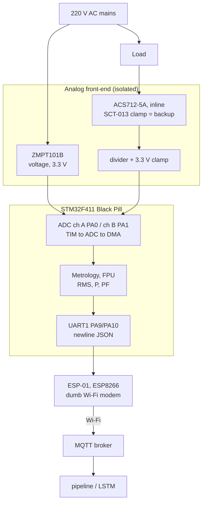

# Energy Node — Real Hardware Build Plan

**Node:** STM32F411 "Black Pill" · **Voltage:** ZMPT101B · **Current:** ACS712-5A
(primary), SCT-013-000 clamp (backup) · **Uplink:** ESP-01 (ESP8266) MQTT bridge
over UART.

This replaces the earlier simulator-only Nucleo-F429ZI + Renode approach. The
STM32 now measures **real AC mains**, computes the metrology on-device, and
publishes the _same JSON schema/topics_ the pipeline already expects — so the
cloud side (Mosquitto → gateway → TimescaleDB → Grafana → LSTM) is unchanged.

> ⚠️ Mains safety is non-negotiable — see [§6](#6-safety-220 v). Develop and
> validate the whole chain on a **6–12 V AC adapter** first; only move to 220 V
> after RMS + MQTT work end-to-end.

---

## 1. Architecture



**Division of labor:** STM32 does _all_ metrology (sampling + math). The ESP-01
is a dumb Wi-Fi modem: it receives one newline-terminated JSON line over UART
and `publish()`es it. Engineering stays on the STM32, where it's defended.

## 2. Bill of materials

| Part                                                    | Role                     | Note                                                   |
| ------------------------------------------------------- | ------------------------ | ------------------------------------------------------ |
| Black Pill STM32F411                                    | MCU + metrology          | has FPU — float RMS is cheap                           |
| ZMPT101B                                                | AC voltage               | **power at 3.3 V**, tune onboard gain pot              |
| ACS712-5A                                               | AC current (primary)     | inline; 5 A ≈ 1.1 kW ceiling; **needs output divider** |
| SCT-013-000                                             | AC current (backup)      | clamp, non-contact; needs burden resistor              |
| ESP-01 (ESP8266)                                        | Wi-Fi/MQTT bridge        | 3.3 V only                                             |
| AMS1117-3.3 + 470 µF                                    | dedicated ESP-01 supply  | ESP-01 browns out on the Black Pill 3.3 V pin          |
| 4×10k, 6.8k/10k, 10 µF, 0.1 µF, 2× 3.3 V zener/Schottky | bias, divider, ADC clamp |                                                        |

## 3. Analog front-end — keep every ADC pin ≤ 3.3 V

The F411 ADC is **3.3 V max**. Both sensors can exceed that.

- **ZMPT101B** — power at **3.3 V**. Output biases near ~1.65 V; turn the gain
  pot **down** so the waveform peak stays under 3.3 V at your highest expected
  voltage (aim 1.65 V ± ~1.2 V). Verify before wiring to the ADC.
- **ACS712-5A** — at 5 V supply it outputs **2.5 V ± 185 mV/A**. At 5 A RMS
  (~7 A peak) that's up to **3.8 V → will damage the ADC pin.** Add a
  **~0.65× resistor divider** on its output (→ ~0.8–2.5 V) and fold the divider
  factor into calibration.
- **Both inputs:** add a **3.3 V clamp** (Schottky/zener to the 3.3 V rail) as a
  fault safety net.
- **DC offset** is removed in firmware (subtract the per-window mean) before RMS.

## 4. STM32 sampling & metrology

- **Timer-triggered ADC + DMA** (not blocking reads). TIM2 triggers ADC1 in
  2-channel scan mode; DMA fills a circular double buffer.
- **Rate:** 3.2 kHz → **64 samples / 50 Hz cycle**.
- **Window:** 10 cycles = 200 ms = 640 sample-pairs; compute on the completed
  half while DMA fills the other (half-transfer interrupt).
- **Per window (float / FPU):**
  - remove DC: `v -= mean(v)`, `i -= mean(i)`
  - `Vrms = sqrt(mean(v²))`, `Irms = sqrt(mean(i²))`
  - real power `P = mean(v·i)`, apparent `S = Vrms·Irms`, `PF = P/S`
  - apply calibration scale factors (§5)
- Average a few windows → **1 telemetry publish / second**.

Metrology lives in `app/metrology.c` as **pure C (no HAL)** so it's unit-tested
on the host (`test/`) — cite that in the thesis.

## 5. Calibration (a real results-chapter contribution)

1. Load = **incandescent bulb** (resistive, PF ≈ 1, easy to verify).
2. Measure true Vrms / Irms with a **multimeter**.
3. Tune `V_SCALE`, `I_SCALE` in `app/config.h` until the STM32 matches.
4. Sweep several loads; record STM32 vs meter → report **% error** and PF
   accuracy. Document the ACS712 divider factor and ZMPT pot setting for
   reproducibility.

## 6. Safety (220 V)

- Never connect mains directly to an STM32 pin — both sensors provide isolation;
  respect it. ACS712 is **inline** → mount in a **sealed enclosure**, no exposed
  terminals, strain-relieved wiring.
- **Validate the full chain on a 6–12 V AC adapter first.** Most development
  never needs live mains.
- Live testing: circuit on an **MCB/RCD**, enclosure closed, one hand, never
  probe live. ADC clamps (§3) protect the MCU from sensor faults.
- ACS712 is 5 A-limited; for >1 kW or non-contact safety, swap to the **SCT-013
  clamp** — firmware is identical, only the current scale factor changes.

## 7. Milestones

| #   | Milestone                                                          | Gate                         |
| --- | ------------------------------------------------------------------ | ---------------------------- |
| 1   | Black Pill blinks + UART loopback to PC                            | toolchain works              |
| 2   | ADC+DMA capturing 2 channels, dump raw over UART                   | clean sine on low-V AC       |
| 3   | `metrology.c` Vrms/Irms/P/PF on bench (12 V AC)                    | matches meter within a few % |
| 4   | ESP-01 publishes JSON to broker                                    | reading appears in pipeline  |
| 5   | Calibrate + go live on 220 V bulb load                             | error table for thesis       |
| 6   | (opt) swap ACS712→SCT-013; (opt) migrate to Nucleo-F429ZI Ethernet | stretch                      |

## 8. Standing constraints

- **Renode can't emulate the analog front-end** — no simulator stand-in for the
  metrology demo; it needs the physical board.
- Report **measured** accuracy vs. the multimeter, not datasheet-ideal numbers.

## 9. Repo layout

```text
firmware/
  hardware-build.md      this file
  README.md              quick-start + workflow
  blackpill-node/
    cubemx-checklist.md  STM32CubeIDE (F411) project configuration
    config.h             pins, ADC rate, calibration constants, broker
    app/                 portable application code (pulled into CubeIDE project)
      metrology.[ch]     pure-C RMS/power/PF from ADC buffers (host-testable)
      adc_sampler.[ch]   TIM+ADC+DMA double-buffer capture (HAL)
      esp01_mqtt.[ch]    UART JSON-line bridge to the ESP-01
      telemetry.[ch]     JSON payload builder (pipeline schema 1.0)
    test/                host unit tests for metrology (no hardware)
    esp01/               ESP8266 MQTT-bridge sketch (Arduino/PubSubClient)
```
