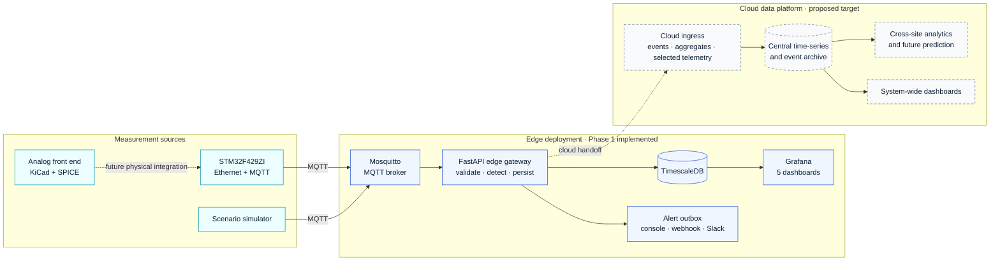
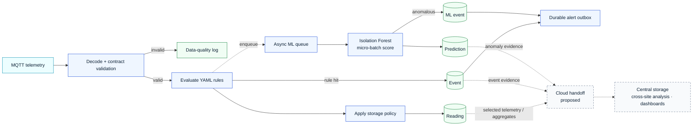
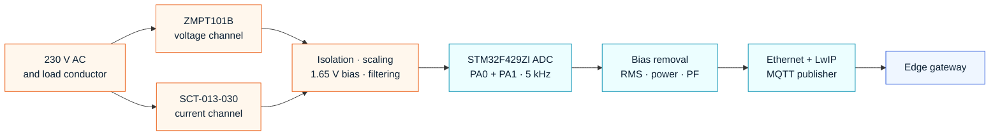
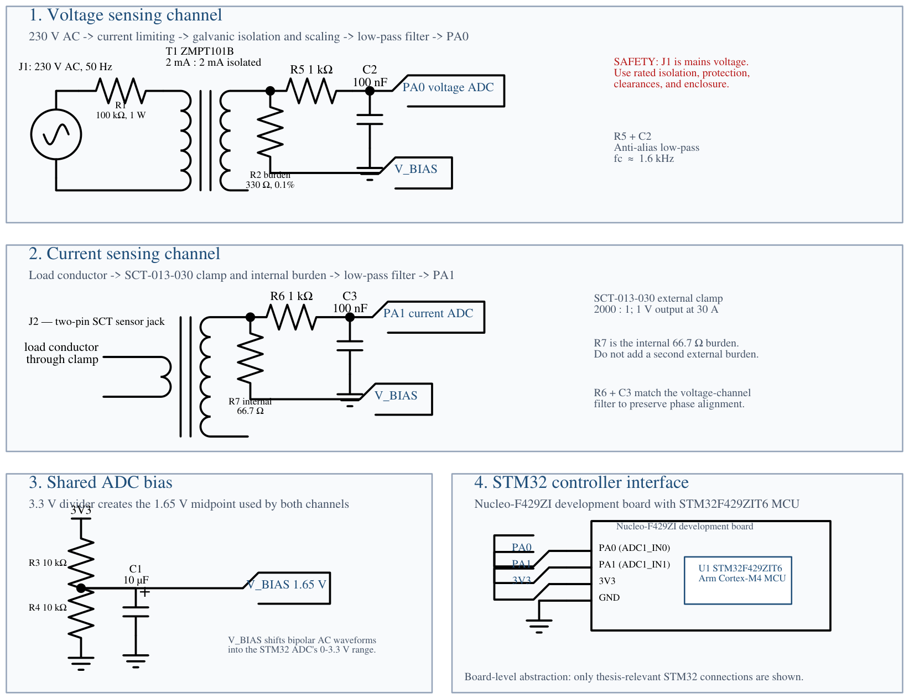
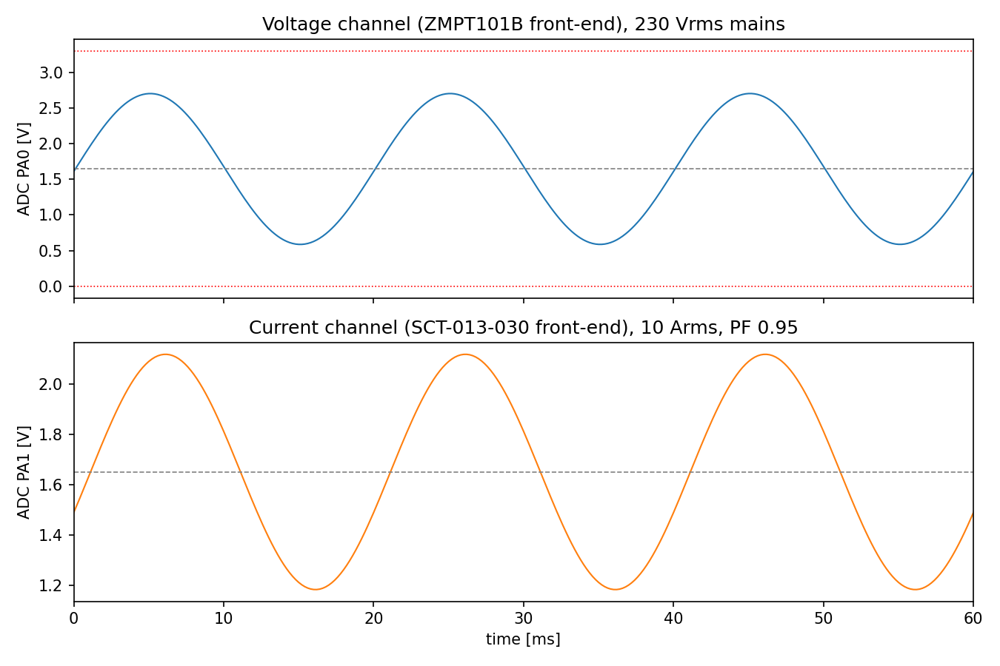
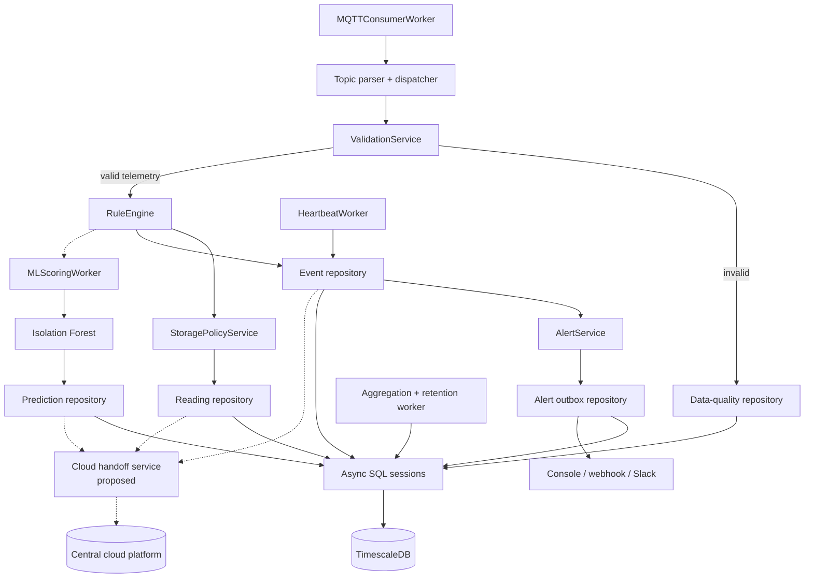

  

    
Thesis idea submission · Phase 1 progress

    <h1>WattFlow</h1>
    

      Design and Evaluation of an Event-Driven Edge–Cloud Data Pipeline for Real-Time Energy Monitoring using STM32
    

    

      STM32 + MQTT
      Event-driven edge gateway
      Real-time energy monitoring
    

  

  

    

    

    
<small>PIPELINE</small><strong>EDGE ↕ CLOUD</strong>

    
STM32

    
Events

    
Monitor

    
 Phase 1 complete

  

  
Presented by<strong>Shafayetul Huda Sadi</strong><small>Student ID · 2110057</small>

  
Department<strong>Department of ECE</strong><small>RUET</small>

  
Institution<strong>Rajshahi University of Engineering &amp; Technology</strong><small>Rajshahi, Bangladesh</small>

  
Supervisor<strong>Prof. Dr. Md. Anwar Hossain</strong><small>Professor · Department of ECE</small>

<!--
Introduce this as both an idea submission and a continuity briefing for the new supervisor.
The original thesis title is retained, while the progress section clearly limits completed work to Phase 1.
-->

---

Thesis vision

# A national energy intelligence platform for Bangladesh

  

    
From one monitored node to one national energy picture

    

      Connect distributed energy data in a single scalable platform for <strong>real-time collection</strong>, <strong>unified analysis</strong>, and future <strong>prediction</strong>.
    

    

      Thesis focus · Phase 1 evidence
      <strong>Design and evaluate the STM32-to-edge-to-cloud monitoring pipeline</strong>
      <small>STM32 sensing → MQTT → event-driven edge processing → cloud evidence</small>
    

    

      
<strong>Edge node</strong>

      <i></i>
      
<strong>Multi-site</strong>

      <i></i>
      
<strong>Nationwide</strong>

    

  

  

    
Long-term system vision

    <svg class="platform-links" viewBox="0 0 430 255" aria-hidden="true">
      <line x1="215" y1="128" x2="88" y2="58" />
      <line x1="215" y1="128" x2="342" y2="58" />
      <line x1="215" y1="128" x2="88" y2="198" />
      <line x1="215" y1="128" x2="342" y2="198" />
    </svg>
    
<small>BANGLADESH</small><strong>ONE ENERGY VIEW</strong>

    
Generation

    
Grid

    
Industry

    
Consumers

    
Shared telemetry · events · analytics

  

  
01<strong>Collect</strong><small>Distributed, near-real-time energy telemetry</small>

  
02<strong>Unify</strong><small>One observable data and event model</small>

  
03<strong>Analyze</strong><small>Quality, events, anomalies, and trends</small>

  
04<strong>Predict</strong><small>Demand, failures, and system risk</small>

<!--
Present the nationwide platform as the north-star vision, not as a result already delivered. Phase 1 is the measurable foundation built in this thesis.
-->

---

Motivation · Original thesis problem

# Why an event-driven edge–cloud pipeline?

  
<i></i><i></i><i></i><i></i><i></i>

  

    Starting point
    <strong>Continuous STM32 energy telemetry</strong>
  

  
→

  

    Research need
    <strong>Timely, trustworthy, and scalable energy evidence</strong>
  

  

    
01<b>≈</b>

    <h3>Data never stops</h3>
    
Voltage, current, power, and status arrive continuously. A store-everything path treats normal and critical readings identically.

    <small>Risk · critical readings look ordinary</small>
  

  

    
02<b>!</b>

    <h3>Events are recognized late</h3>
    
If processing begins only after cloud storage, overload, voltage deviation, invalid data, or device silence may be classified too late.

    <small>Risk · response begins after storage</small>
  

  

    
03<b>?</b>

    <h3>The system cost is unclear</h3>
    
Many prototypes show a dashboard, but do not measure the latency, throughput, validation, and intelligence cost of the edge–cloud split.

    <small>Gap · architecture without evaluation</small>
  

  

    
 Store-first baseline

    
STM32<b>→</b>MQTT<b>→</b>Cloud / DB<b>→</b>Dashboard

    <small>Store first; interpret later</small>
  

  
SHIFT<b>→</b>

  

    
 Thesis design

    
STM32<b>→</b>MQTT<b>→</b>Edge validate + detect<b>→</b>Cloud / view

    <small>React locally; preserve system-wide evidence</small>
  

  

<strong>Phase 1 complete</strong><small>Edge gateway · rules + Isolation Forest · measured evaluation</small>

  

  
Next evidence<small>Physical STM32 integration · cloud handoff evaluation</small>

<!--
Tie each limitation to the original STM32 edge–cloud pipeline proposal. Phase 1 evaluates the edge foundation rather than claiming national deployment.
-->

---

Research positioning

# Research gap

  

    
Prior work establishes the individual building blocks:

    

      
<strong>STM32 / IoT metering</strong> Connected sensing prototypes [1]

      
<strong>MQTT + cloud monitoring</strong> Messaging and remote data access [4,5]

      
<strong>Edge / fog processing</strong> Local response and resilience [2]

      
<strong>Energy-event detection</strong> Rules and data-driven methods [3]

    

  

  

    <h3>Gap addressed by this thesis</h3>
    
Few prototypes evaluate the complete <strong>STM32 → MQTT → edge events → cloud evidence</strong> path as one system. This thesis measures:

    

      throughput
      latency
      validation
      detection quality
      edge cost
      data movement
    

  

Research focus: an integrated architecture plus reproducible evaluation—not a new sensing device or anomaly algorithm in isolation.

<!--
The gap is the measured integration, not the existence of any individual technology.
This wording is deliberately conservative and defensible.
-->

---

Research design

# Aim, objectives, and questions

  

    

      <strong>Aim:</strong> Design and evaluate an event-driven edge–cloud data pipeline for real-time energy monitoring using STM32.
    

    <h3 style="margin-top: 20px">Objectives</h3>
    <ol class="small">
      <li>Design the STM32 sensing, processing, and MQTT telemetry contract.</li>
      <li>Implement event-driven validation and event detection at the edge.</li>
      <li>Define the edge–cloud responsibility split, storage, and visualization flow.</li>
      <li>Evaluate latency, throughput, event quality, and data-movement cost.</li>
    </ol>
  

  

    

      <h3>RQ1 · Architecture</h3>
      
How should sensing, event processing, and system-wide analysis be partitioned across STM32, edge, and cloud?

    

    

      <h3>RQ2 · Performance</h3>
      
How does the event-driven design affect ingestion latency and throughput compared with a store-first baseline?

    

    

      <h3>RQ3 · Event value</h3>
      
Can local validation and detection create timely evidence without blocking continuous telemetry or losing cloud visibility?

    

  

<!--
RQ1–RQ3 keep the thesis centered on the complete data pipeline. Edge ML is one evaluated event-processing component.
-->

---

Evidence boundaries

# What the thesis includes—and does not claim

  

    <h3>Thesis design and evaluation</h3>
    <ul class="small">
      <li>STM32 sensing and MQTT telemetry contract</li>
      <li>Event-driven ingestion, validation, rules, and edge ML</li>
      <li>Proposed edge–cloud responsibility and data flow</li>
      <li>Time-series persistence, events, alerts, and dashboards</li>
      <li>Controlled simulator-based A/B experiments</li>
      <li>Firmware emulation and circuit-level simulation</li>
    </ul>
  

  

    <h3>Not claimed as completed</h3>
    <ul class="small">
      <li>Certified billing-grade measurement accuracy</li>
      <li>Physically integrated and calibrated field hardware</li>
      <li>Long-duration production reliability</li>
      <li>Real-world sequential ML performance</li>
      <li>Full cloud integration or distributed deployment</li>
      <li>Nationwide energy-system operation</li>
      <li>Production security and device credentials</li>
    </ul>
  

  <strong>Evidence levels:</strong> edge pipeline completed · STM32 firmware emulator-validated · analog circuit simulated · full cloud path proposed · physical and nationwide deployment future.

<!--
This is an important trust slide for a new supervisor. Be explicit about what is real, simulated, and planned.
-->

---

Proposed solution

# From store-first upload to edge–cloud event flow

  

    <h2>Baseline</h2>
    

      STM32 node ↓ MQTT broker ↓ <strong>Upload and store every reading</strong> ↓ Cloud dashboard
    

  

  

    <h2>Proposed</h2>
    

      STM32 → MQTT → edge gateway ↓ <strong>Validate → detect → classify events</strong> ↓ Selected telemetry + events + quality evidence ↓ Cloud aggregation · storage · dashboards
    

  

The evaluation measures whether earlier event processing improves timeliness and evidence quality without compromising telemetry ingestion.

<!--
Define baseline carefully: it still validates enough to accept a typed reading, but disables proposed-mode rule and ML processing for the clean comparison.
-->

---

class: diagram-slide

---

Architecture

# End-to-end system context

<strong>Solid path:</strong> implemented Phase 1 edge foundation. <strong>Dashed handoff:</strong> proposed cloud integration for system-wide analysis.

<!--
Walk left to right. The thesis architecture includes the cloud target, while current experimental evidence is concentrated at the edge.
-->

---

class: diagram-slide

---

System diagram

# What happens to one MQTT reading?

The completed edge path creates readings and events; the proposed handoff preserves selected evidence for cloud-scale analysis.

<!--
Emphasize the two branches: invalid messages become quality evidence; valid messages continue through deterministic and optional ML processing.
-->

---

class: diagram-slide

---

Hardware system

# Measurement-node signal chain

  
Circuit <strong>KiCad + ngspice</strong> Design-value simulation

  
Firmware <strong>STM32 + Renode</strong> Real MQTT through the stack

  
Physical node <strong>Future integration</strong> Calibration and field testing

<!--
Make the evidence boundary explicit: the circuit and firmware were validated separately, not as one physical co-simulation.
-->

---

Circuit design

# Isolated voltage and current sensing front end

Publication schematic: two isolated channels, matched anti-alias filters, shared 1.65 V ADC bias, and STM32F429ZI interface.

<!--
Explain the four numbered regions. Mention mains safety: the voltage input requires rated isolation, protection, clearances, and enclosure. It is not a breadboard circuit.
-->

---

Edge event processing · Phase 1

# Phase 1 detection modes

  

    <h3>1 · Deterministic rules</h3>
    
Configurable thresholds and state logic for known violations.

    
explainablefast

    
Overload · voltage deviation · power spike · temperature · device silence

  

  

    <h3>2 · Edge Isolation Forest</h3>
    
Unsupervised scoring over raw and physics-informed features.

    
lightweightadaptive

    
$[V, I, P, T, |V-220|, P-VI]$

  

  

    <h3>3 · Hybrid mode</h3>
    
Run deterministic rules and edge Isolation Forest together.

    
complementarymeasurable

    
Rule events + ML anomaly evidence through the same event and alert path

  

  Rules protect explicit operational bounds; edge ML adds distribution-based evidence; hybrid mode measures their combined behavior.

<!--
Do not describe ML as replacing rules. The thesis result is that the layers have different strengths.
-->

---

Methodology

# Evaluation strategy

  

    <h3>A · End-to-end pipeline cost</h3>
    
200 devices · 1-second interval · approximately 120 seconds · three repetitions per mode

    
throughputavg / p95 / p99 latencyDB growth

  

  

    <h3>B · Event and data quality</h3>
    
Controlled overload, power spike, under/over-voltage, device failure, and invalid-payload streams

    
event countsvalidation errorsalert evidence

  

  

    <h3>C · Edge processing cost</h3>
    
Rules vs ML vs hybrid, plus inline vs asynchronous inference

    
precision / recallingest latencyqueue delay

  

  

    <h3>D · Edge–cloud handoff Planned</h3>
    
Compare raw forwarding with event- and evidence-oriented cloud delivery

    
forwarded volumeend-to-end delayevidence completeness

  

A–C have Phase 1 evidence; D completes the evaluation of the full edge–cloud thesis target.

<!--
Explain independent variables and measurements. The thesis is evaluated as a system, not only demonstrated as an application.
-->

---

Expected contribution

# What this thesis contributes

  
1<strong>Architecture</strong>
A traceable STM32 → MQTT → edge → cloud design for real-time monitoring.

  
2<strong>Measured overhead</strong>
A controlled baseline/proposed comparison rather than an unmeasured prototype.

  
3<strong>Event model</strong>
Validated readings, quality failures, rules, and ML evidence through one observable flow.

  
4<strong>Edge intelligence</strong>
Measured rules and asynchronous ML as components—not the thesis identity.

  
5<strong>Reproducibility</strong>
Versioned configuration, migrations, experiment scripts, and pinned results.

  
6<strong>Scaling path</strong>
A clear route from one STM32 node to multi-site and national energy views.

<!--
If asked for novelty, emphasize the integrated and measured research method rather than claiming a new algorithm.
-->

---

Progress to date

# Work completed so far

  

    
Implemented<h3 style="margin-top: 10px">Pipeline foundation</h3>
STM32 contract, MQTT, validation, storage, dashboards, APIs, and alerts

  

  

    
Completed<h3 style="margin-top: 10px">Phase 1</h3>
Edge Isolation Forest, async micro-batching, rules/ML/hybrid evaluation

  

  

    
Validated<h3 style="margin-top: 10px">Phase 1 evidence</h3>
Offline detection quality and online operational-cost measurements

  

  

    
Next<h3 style="margin-top: 10px">Complete edge–cloud scope</h3>
Physical node, cloud handoff, repeat runs, and thesis consolidation

  

  The project has moved beyond an idea-only proposal: the current task is to align the final thesis scope with the new supervisor.

<!--
This is the transition into evidence. Clarify that completed means implemented and tested within the stated simulator/emulator scope.
-->

---

Implementation status

# Phase 1 implementation status

  

Area

Status

Evidence boundary

  

MQTT → database pipeline

Implemented

FastAPI, Mosquitto, Alembic, TimescaleDB

  

Rules, alerting, dashboards

Implemented

Six rules, durable outbox, five Grafana dashboards

  

Phase 1 edge ML

Complete

Isolation Forest, prediction storage, ML events, async worker

  

STM32 firmware

Validated

Compiled firmware exercised end-to-end in Renode

  

Analog front end

Validated

KiCad design and ngspice chain validation

  

Physical calibrated meter

Pending

No integrated field hardware or certified accuracy claim

  

Cloud pipeline integration

Proposed

Responsibility and handoff defined; implementation/evaluation pending

  

Nationwide platform

Vision

Long-term motivation, outside the completed thesis evidence

<!--
This table is aligned to the current architecture document. Do not replace these statuses with a single completion percentage.
-->

---

Preliminary result · system cost

# Edge intelligence adds a small ingest overhead

  

    
  

  

    
≈202 msg/smatched simulator throughput

    
+0.32 msaverage proposed-mode overhead

    
3 + 3 runsbaseline and proposed repetitions

  

The proposed gateway preserved throughput while adding validation, rules, event evidence, and observability.

<!--
State that these are local Docker experiments. The result supports low overhead under this tested load, not universal scalability.
-->

---

Phase 1 result · detection quality

# Edge Isolation Forest: offline evaluation

  
0.612precision

  
0.780recall

  
0.686F1 score

  
0.099false-positive rate

  
<h3>Detected well</h3>
Over-voltage 0.99 · power spike 0.86 · under-voltage 0.83 recall

  
<h3>Important weakness</h3>
Overload recall was 0.44 because the simulated normal load already overlaps the fixed overload region.

Offline result on simulator-faithful synthetic data; it is not a field-accuracy claim.

<!--
The weak overload result is useful rather than embarrassing: it shows that a fixed rule and a distribution-based model answer different questions.
-->

---

Phase 1 result · operational cost

# Asynchronous scoring protects ingestion latency

  

    
  

  

    

      
6.35 msML-mode ingest average

      
10.35 msML-mode ingest p99

      
≈49 msenqueue-to-score delay

      
50 msconfigured batch window

    

    
The inference cost moved away from the synchronous telemetry path into a bounded asynchronous queue.

  

<!--
This experiment demonstrates decoupling, not high-throughput batch amortisation; the tested anomaly stream averaged only about 2.3 messages per second.
-->

---

Interpretation

# What the evidence supports

  

    <h3>Pipeline claim</h3>
    
The implemented event-driven edge path preserves throughput with low measured ingestion overhead.

  

  

    <h3>Event claim</h3>
    
Validation, rules, and ML produce complementary operational evidence.

  

  

    <h3>Architecture claim</h3>
    
Asynchronous work supports a responsive edge tier; the cloud handoff remains to be evaluated.

  

The defensible contribution is the designed STM32 edge–cloud architecture and measured Phase 1 edge foundation—not a claim of completed cloud or national deployment.

<!--
This is the key synthesis. Pause here and let the three claims land before moving to limitations.
-->

---

Limitations

# Where the conclusions stop

  

    <h3>Experimental limitations</h3>
    <ul class="small">
      <li>Simulator-derived data and short local Docker runs</li>
      <li>Single global edge model rather than per-device models</li>
      <li>Offline labels come from simulator-derived synthetic scenarios</li>
      <li>Online A/B runs need additional repetitions at higher rates</li>
    </ul>
  

  

    <h3>Engineering limitations</h3>
    <ul class="small">
      <li>No integrated, calibrated physical sensing node</li>
      <li>No MQTT TLS, API authorization, or per-device credentials</li>
      <li>Edge model is not yet optimized for a constrained physical target</li>
      <li>No production deployment or long-duration soak evidence</li>
      <li>No implemented or measured cloud handoff yet</li>
    </ul>
  

The current results do not prove storage reduction; additional prediction and event evidence can increase database growth.

<!--
Limitations strengthen the thesis when they are connected to concrete next experiments.
-->

---

Next steps

# Proposed remaining work and scope decisions

  

    <h3>Recommended priority</h3>
    <ol>
      <li><strong>Freeze the STM32 edge–cloud title and evidence scope</strong> with the new supervisor.</li>
      <li>Integrate and calibrate one physical STM32 sensing node, if feasible.</li>
      <li>Implement the cloud handoff and central aggregation path.</li>
      <li>Repeat end-to-end latency, throughput, and data-movement experiments.</li>
      <li>Consolidate chapters, figures, citations, and reproducibility artifacts.</li>
    </ol>
  

  

    <h3>Questions for supervisor alignment</h3>
    <ul class="small">
      <li>Is the proposed title and edge–cloud scope appropriately focused?</li>
      <li>How much physical hardware evidence is required?</li>
      <li>Should the next experiment prioritize physical STM32 integration or the cloud handoff?</li>
      <li>What minimum cloud implementation is required to support the title?</li>
      <li>What milestones and submission dates should govern the remaining work?</li>
    </ul>
  

<!--
Ask for decisions, not only feedback. The current presentation deliberately stops at the completed Phase 1 scope.
-->

---

layout: center
class: text-center

---

Proposed thesis claim

# An event-driven STM32 edge–cloud pipeline

WattFlow designs an STM32-to-edge-to-cloud pipeline for real-time energy monitoring. Phase 1 shows that event-driven validation, rules, and lightweight ML can run at the edge with small measured overhead; physical integration and full cloud-path evaluation are the next evidence milestones.

<strong>Questions and scope discussion</strong>

<!--
End on the claim, then invite the supervisor to discuss scope. Do not end on the limitations slide.
-->

---

layout: center
class: text-center

---

Appendix

# Supporting technical evidence

Use the following slides for questions about circuit validation, ML latency, internal architecture, implementation choices, and sources.

---

Appendix A · Circuit evidence

# SPICE-to-firmware measurement-chain validation

  

    
  

  

    <table>
      <thead><tr><th>Quantity</th><th>True</th><th>Recovered</th><th>Error</th></tr></thead>
      <tbody>
        <tr><td>$V_{rms}$</td><td>230 V</td><td>226.8 V</td><td>−1.4%</td></tr>
        <tr><td>$I_{rms}$</td><td>10 A</td><td>9.90 A</td><td>−1.0%</td></tr>
        <tr><td>$P$</td><td>2185 W</td><td>2131 W</td><td>−2.5%</td></tr>
        <tr><td>PF</td><td>0.950</td><td>0.949</td><td>−0.1%</td></tr>
      </tbody>
    </table>
    
Circuit-level simulation plus numerical replication of firmware math—not a physical calibration result.

  

---

Appendix B · Edge ML cost

# Asynchronous scoring decouples inference from ingestion

  

    
  

  

    <h3>Before</h3>
    
Per-reading synchronous `score_samples` added approximately 12 ms to telemetry latency.

    <h3 style="margin-top: 20px">After</h3>
    
A bounded micro-batch worker returned telemetry latency to rule-only levels.

    <h3 style="margin-top: 20px">Trade-off</h3>
    
The cost moved to approximately 49 ms enqueue-to-score delay, dominated by the 50 ms batch window.

  

---

class: diagram-slide

---

Appendix C · Gateway internals

# Runtime component ownership

---

Appendix D · Technology map

# Implementation stack

| Layer          | Technology                            | Responsibility                                             |
| -------------- | ------------------------------------- | ---------------------------------------------------------- |
| Sensing design | ZMPT101B, SCT-013-030, KiCad, ngspice | Isolated voltage/current acquisition and analog validation |
| Firmware       | STM32F429ZI, LwIP, MQTT               | Sampling, electrical calculations, network publishing      |
| Messaging      | Eclipse Mosquitto                     | Publish/subscribe decoupling                               |
| Edge gateway   | FastAPI, Pydantic, SQLAlchemy async   | Validation, detection, APIs, metrics, workers              |
| Edge ML        | scikit-learn Isolation Forest         | Lightweight unsupervised anomaly scoring                   |
| Storage        | PostgreSQL + TimescaleDB + Alembic    | Time-series and operational evidence                       |
| Visualization  | Grafana                               | Five provisioned dashboards                                |
| Cloud target   | Central ingestion + data platform     | Cross-site aggregation, archive, analytics, and dashboards |
| Experiments    | Docker Compose, Bash/Python harnesses | Controlled A/B execution and evidence export               |

---

Appendix E · Selected references

# Research foundations

  
<strong>[1]</strong> D. A. Verde Romero et al., “An open source IoT edge-computing system for monitoring energy consumption in buildings,” <em>Results in Engineering</em>, vol. 21, 2024.

  
<strong>[2]</strong> R. K. Naha et al., “Fog Computing: Survey of Trends, Architectures, Requirements, and Research Directions,” 2018.

  
<strong>[3]</strong> R. B. Mofidul et al., “Real-Time Energy Data Acquisition, Anomaly Detection, and Monitoring System,” <em>Sensors</em>, vol. 22, no. 22, 2022.

  
<strong>[4]</strong> OASIS, “MQTT Version 5.0,” OASIS Standard, 2019.

  
<strong>[5]</strong> V. C. Gungor et al., “Survey of Smart Metering Communication Technologies,” <em>IEEE Communications Surveys & Tutorials</em>, 2011.

  
<strong>[6]</strong> A. Chatterjee and B. S. Ahmed, “IoT anomaly detection methods and applications: A survey,” <em>Internet of Things</em>, 2022.

Complete citations and the source PDFs are maintained in the thesis literature-review workspace.

