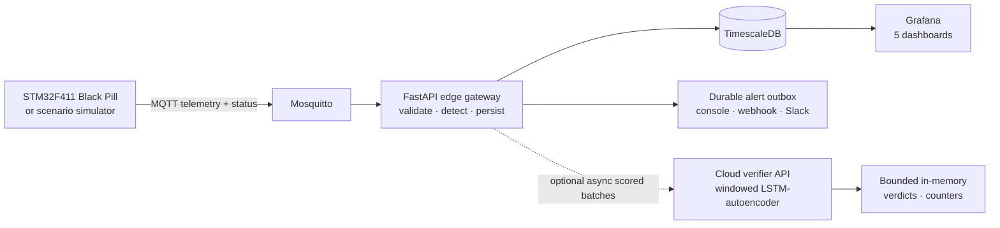
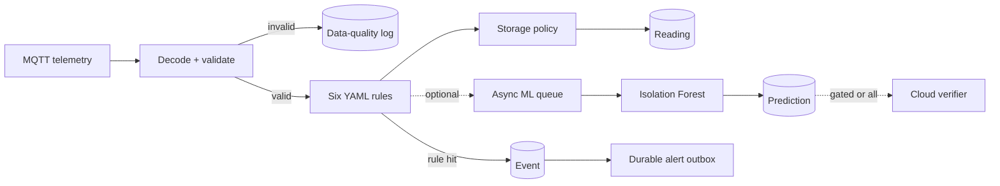
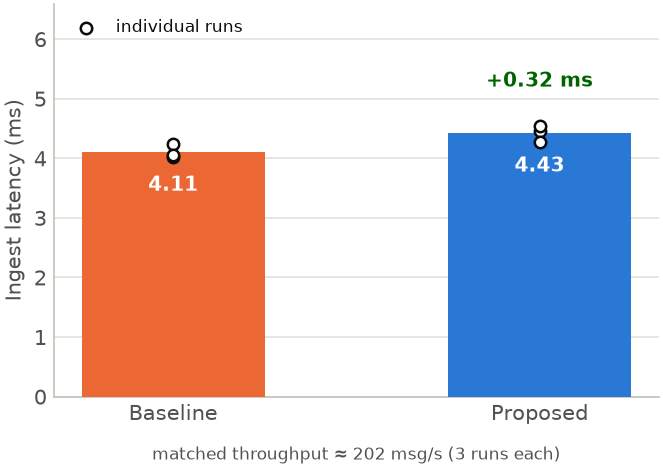
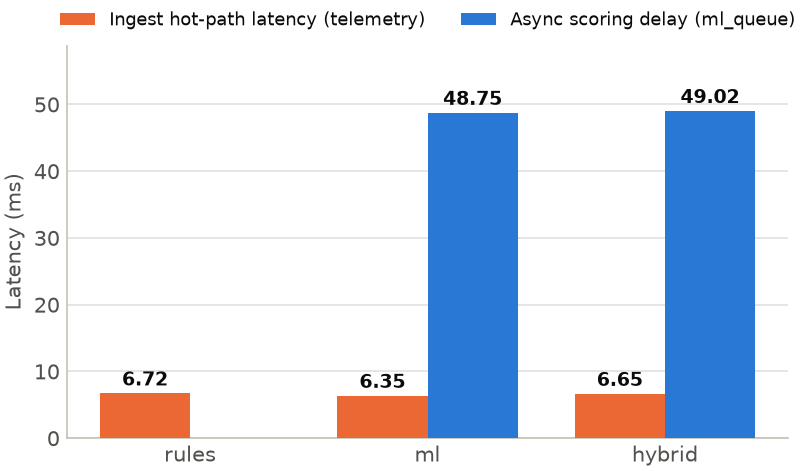

  

    
Thesis project · current status

    <h1>WattFlow</h1>
    
An event-driven edge–cloud pipeline for real-time energy monitoring using STM32

    
STM32 + MQTTEdge intelligenceCloud verification

  

  

    

    
<small>PIPELINE</small><strong>EDGE ↕ CLOUD</strong>

    
Sense

Events

Verify

    
 Software Phases 1–3 evaluated

  

  
Presented by<strong>Shafayetul Huda Sadi</strong><small>Student ID · 2110057</small>

  
Department<strong>Department of ECE</strong><small>RUET</small>

  
Supervisor<strong>Prof. Dr. Md. Anwar Hossain</strong><small>Professor · Department of ECE</small>

---

Research focus

# The problem, aim, and questions

  

    
<h3>Problem</h3>
Continuous energy telemetry is useful only if invalid readings, operational violations, and anomalous behavior become timely, trustworthy evidence.

    
<h3>Aim</h3>
Design and evaluate an event-driven edge–cloud data pipeline for real-time energy monitoring using STM32.

  

  

    <h3>Research questions</h3>
    <ol class="small">
      <li>How should sensing, edge processing, and cloud verification be partitioned?</li>
      <li>What ingestion overhead does validation, event detection, and asynchronous ML add?</li>
      <li>Can selective forwarding and cloud verification improve evidence quality without blocking ingestion?</li>
    </ol>
  

The contribution is an integrated, measured system—not a claim of a new anomaly-detection algorithm or a nationwide deployment.

---

Current architecture

# What is implemented now

Detection and persistence remain available at the edge. The optional cloud verifier is not on the critical ingestion path and is not a durable system of record.

---

Edge processing

# One telemetry message, two evidence paths

  
<strong>Validation</strong> Reject malformed, out-of-range, and contract-inconsistent payloads.

  
<strong>Detection</strong> Rules cover known limits; ML adds distribution-based evidence.

  
<strong>Boundary</strong> Cloud verdicts are currently process memory and clear on restart.

---

Hardware path

# Current physical-node design: ready for bench validation

  

    <h3>STM32F411 “Black Pill” node</h3>
    <ul class="small">
      <li>ZMPT101B voltage sensing; ACS712-5A current sensing, with SCT-013-000 as a backup option.</li>
      <li>Timer-triggered two-channel ADC + DMA at 3.2 kHz.</li>
      <li>On-device RMS, real power, and power-factor calculation.</li>
      <li>ESP-01 acts as a UART-to-MQTT Wi-Fi bridge; STM32 owns the metrology.</li>
    </ul>
  

  

    
Verified<h3 style="margin-top: 10px">Metrology core</h3>
Host tests passed for 230 V / 5 A resistive input, 60° lagging power factor, and empty-input guard behavior.

    
Pending<h3 style="margin-top: 10px">Physical evidence</h3>
Low-voltage bench integration, MQTT end-to-end device run, multimeter calibration, and safe mains testing are not yet evidenced.

  

The deck does not claim field metering accuracy. Calibration must be reported against a multimeter after physical assembly.

---

Implementation status

# What is complete, optional, and still open

  

Area

Status

Evidence boundary

  

MQTT → database pipeline

Implemented

FastAPI, Mosquitto, Alembic, TimescaleDB

  

Rules, alerts, dashboards

Implemented

Six rules, durable outbox, five Grafana dashboards

  

Edge ML · Phase 1

Evaluated

Isolation Forest with inline/asynchronous scoring; off by default

  

Cloud gate · Phase 2

Evaluated

Gated/all forwarding with application-payload byte counters; off by default

  

Cloud verifier · Phase 3

Evaluated

Optional LSTM-autoencoder; recent state is in memory only

  

Physical meter / production security

Open

No calibrated field node, API auth, MQTT TLS, or device credentials

---

Evaluation design

# Reproducible evidence, with explicit boundaries

  

    <h3>Measured lanes</h3>
    <ul class="small">
      <li>Repeated baseline vs proposed ingestion A/B</li>
      <li>Rules-only vs ML-only vs hybrid operation</li>
      <li>Gated vs all-to-cloud forwarding</li>
      <li>Offline edge-only vs two-stage cloud verification</li>
    </ul>
  

  

    <h3>What these results do not establish</h3>
    <ul class="small">
      <li>Field measurement accuracy or long-duration reliability</li>
      <li>Production readiness, security, or distributed elasticity</li>
      <li>Storage reduction or full wire-level bandwidth</li>
      <li>Real-world sequential ML performance</li>
    </ul>
  

Headline comparisons use pinned result artifacts. Precision, recall, and false-positive claims come from labeled offline evaluation; online experiments measure operational behavior.

---

Result · ingestion cost

# Edge intelligence preserved matched throughput

  
  

    
≈202 msg/smatched simulator throughput

    
+0.32 msaverage proposed-mode overhead

    
3 + 3 runsbaseline and proposed repetitions

  

Under this controlled load, validation, rules, events, and observability added a small ingestion overhead without reducing the matched throughput.

---

Result · edge intelligence

# Asynchronous scoring protects the ingest path

  
  

    

      
6.35 msML-mode ingest average

      
10.35 msML-mode ingest p99

      
≈49 msenqueue-to-score delay

      
50 msconfigured batch window

    

    
The cost moves into a bounded asynchronous queue instead of blocking each incoming telemetry message.

  

---

Result · cloud path

# Selective forwarding and cloud verification improved the evidence trade-off

  
−53.1%application-payload bytes vs all-to-cloud

  
0.910two-stage offline precision

  
0.838two-stage offline F1

  
643edge false positives suppressed offline

  
<h3>Phase 2 · score-gated forwarding</h3>
The controlled run sent 623 readings / 211,955 bytes with gating, versus 1,378 readings / 452,381 bytes in all-to-cloud mode.

  
<h3>Phase 3 · two-stage verifier</h3>
On the labeled held-out set, precision increased from 0.663 to 0.910 while recall changed from 0.783 to 0.776.

The bandwidth comparison is online application-payload evidence; verification quality is offline synthetic-data evidence. They should not be conflated.

---

Thesis position

# The defensible current claim

WattFlow is an edge-first, event-driven observability pipeline for energy monitoring. The evaluated software path validates telemetry, creates local operational evidence, selectively forwards scored batches, and optionally verifies them in the cloud without placing cloud work on the ingestion critical path.

  
<h3>Supported</h3>
Implemented edge pipeline and controlled Phases 1–3 software evidence.

  
<h3>Not yet supported</h3>
Calibrated field hardware, durable cloud archival, production security, or nationwide operation.

  
<h3>Research value</h3>
A reproducible architecture with measured performance and evidence-quality trade-offs.

---

Remaining work

# Next milestones

  

    <h3>Priority implementation evidence</h3>
    <ol class="small">
      <li>Assemble and validate the Black Pill node on low-voltage AC.</li>
      <li>Calibrate against a multimeter across several loads; report error and power factor.</li>
      <li>Demonstrate physical MQTT-to-dashboard flow before any safe mains test.</li>
      <li>Repeat selected performance experiments after physical integration.</li>
    </ol>
  

  

    <h3>Scope decisions</h3>
    <ul class="small">
      <li>Whether durable cloud archival is required beyond the evaluated verifier.</li>
      <li>Whether production security is thesis scope or explicitly future work.</li>
      <li>How much physical calibration evidence is required for submission.</li>
      <li>Whether Kubernetes autoscaling remains a future extension.</li>
    </ul>
  

---

Conclusion

# From telemetry to defensible energy evidence

The software pipeline is implemented and evaluated through edge detection, selective cloud forwarding, and optional cloud verification. The next thesis-critical evidence is a calibrated physical measurement node—not a broader architecture rewrite.

<strong>Questions and scope discussion</strong>

